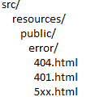
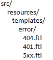

#### 1.参数设置

(1) 场景:账号密码加密放在配置文件不安全，程序启动时传入参数

①用依赖注入获得ApplicationArguments对象，配置main方法传入参数(打成jar包也可传递参数在命令行末尾加如{  ...xx.jar password=123})。    ②application.properties可以放在多个位置：当前项目config下>放在当前项目下>resources>resources下的config;注意相同参数高优先级覆盖,不同的合并;若非标准配置文件命名需要用其他方式(即不能自动读该配置)   ③常见配置server.port(配置访问端口)/server.servlet.context-path(配置上下文路径)

(2)配置文件参数注入(该注解支持松绑定)

①自己写的类:@ConfigurationProperties("配置文件前缀")贴组件类上   ②第三方jar中的类:贴方法上   ③若不在配置文件中设置参数,打包后传参数(...xx.jar --db.username=root)   

#### 3.热部署

(1)jrebel(7.0以上)

①收费:翻墙去用Facebook免费注册账号  ②待详细了解

(2)spring-boot-devtools (idea中需要buil项目才能热部署)

原理:通过监控classpath的变化,如果classpath中的文件发生变化,即触发重启;SpringBoot通过两个classpath来完成reload,一个basic classloader中加载不变的类,一个restart classloader中加载classpath中的类,重启的时候,restart classloader中的类丢弃并重新加载

```properties
#重启排除项(idea中需要buil项目才能热部署,包括静态资源)
spring.devtools.restart.exclude=static/**,templates/**
#从重启排除项排除
spring.devtools.restart.additional-exclude=public/**
#禁用自动重启
spring.devtools.restart.enabled=false 
#可以使用triggerfile的重启策略:(trigger.file内容改变才会触发重启)
#注意这个文件不要放到default_excludes目录下面
spring.devtools.restart.triggerFile=trigger.file
```

#### 4.mybatis、事务、freemark集成即统一错误处理

(1)mybatis集成

①mybatis集成:引入start依赖->引入xml编译依赖->application.properties中配置3项,由于DataSource自动引入->主配置文件引入@MapperScan("mapper接口包名")   ②mybtis中mapperscan会将mapper接口代理，**mapper接口名要和mapper映射文件名相同**。别名/mapper映射文件扫描(若和mapper接口同包可以不用配)

(2)事务控制

​	①注解方式:开启事务的类贴注解+只读方法贴注解(标识为只读)   

​	②xml方式:ⅠJavaconfig类和config.xml关联   Ⅱ在配置类声明事务管理器txMnager,用于注入dataSource和绑定id名

(3)freemark集成

​	①常见模板引擎技术:jsp、freemarker、 Velocity 、thymeleaf(减少前后端开发冲突,但是较为影响性能)

​	②集成:引入spring-start-freemarker,配置ftl页面session可用和缓存不可用。动态模板默认存储文件夹:templates

```properties
#设置session在页面可显示，默认为false(request同理)
spring.freemarker.expose-session-attributes=true
#允许session同名属性覆盖model中属性值,默认false(request同理)
spring.freemarker.allow-session-override=true
#是否开启缓,存默认为true,开发时建议为false
spring.freemarker.cache=false
```

(4)错误统一处理

​	①springboot默认情况下将所有的错误都定位到/error这个处理路径下		

|           静态错误页面默认结构            |             模板错误页面默认结构             |
| :---------------------------------------: | :------------------------------------------: |
|  |  |

```

```

